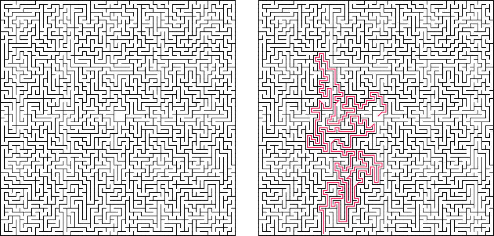

## Prologue

I’ve always found standard maze generation tutorials a bit boring. Most of them rely on a standard grid that outputs plain console characters or pixelated blocks. They work, but they lack any real artistic style or flexibility. A typical generator uses coordinates starting at `(0,0)` in the top-left corner, which is fine for basic grids but fails if you want to build in custom constraints from the start-like making an unchangeable starting courtyard sit right in the dead center of your map.

I wanted to build something cleaner. In this post, we’ll build an asymmetric maze engine from scratch. It uses a custom coordinate setup centered around a zero-point `(0,0)`, automatically handles aspect ratio tweaks, tracks the escape route on the fly during a depth-first search (DFS), and renders sharp, clean vector SVGs with zero overlapping wall paths.

---

## The Core Idea

The engine is built around five straightforward concepts:

1. **The Center-Out Grid:** Designing cells using custom coordinates so the maze expands outward from a true `(0,0)` center.
2. **Pre-hollowed Courtyards:** Carving out an open $3\times3$ starting zone right at the beginning and locking it so the generation algorithm can't mess with it.
3. **Smart SVG Rendering:** Instead of drawing four walls for every single cell - which creates overlapping lines and massive file sizes - cells only render their `up` and `right` walls, leaving outer edges to be handled separately.
4. **Asymmetric Bounds:** Using different widths and heights so the maze cleanly fits custom display limits.
5. **On-the-Fly Path Tracking:** Snapping a quick picture of the execution stack the exact millisecond the generator hits an outer edge tile.



---

## Phase 1: Environment Setup & Cell Layout

First, let's set up our notebook environment and structure our basic data fields. We'll use `IPython` to handle native browser SVG formatting, and standard Python random tools for making algorithmic choices.

```bash
# Optional plotting additions for testing
pip install matplotlib

```

Next, let's look at how we define a single `Cell`. Each unit tracks its own walls and path connections independently.

```python
class Cell:
    """Represents a single square unit in the maze grid."""
    def __init__(self, x, y):
        self.x = x
        self.y = y
        
        # Tracks structural walls (True means a solid wall exists)
        self.walls = {'up': True, 'down': True, 'left': True, 'right': True}
        
        # Tracks path connectivity (True means the path flows into this neighbor)
        self.connections = {'up': False, 'down': False, 'left': False, 'right': False}
        
        # Helper flag for tracking path generation states
        self.visited = False

```

---

## Phase 2: Building the Coordinate Grid & Courtyard

Instead of running a basic nested loop from `0` to `width`, we build a grid that stretches between negative and positive limits. This makes placing a centered courtyard incredibly simple, because we can just target a $3\times3$ box right around the `(0,0)` origin.

```python
class ExistentialMazeGrid:
    """Manages an X x Y rectangular matrix of cells centered at (0,0)."""

    def __init__(self, radius_x, radius_y):
        self.half_w = radius_x
        self.half_h = radius_y
        self.width = radius_x * 2
        self.height = radius_y * 2
        
        # Build the rectangular coordinate map containing Cell instances
        self.grid = {}
        for y in range(-self.half_h, self.half_h):
            for x in range(-self.half_w, self.half_w):
                self.grid[(x, y)] = Cell(x, y)
                
        self.solution_path = []

    def get_cell(self, x, y):
        return self.grid.get((x, y), None)

```

To give our maze a clear starting area, we break the inside walls of the $3\times3$ grid around `(0,0)` and mark them all as visited before the path generation algorithm even kicks off.

```python
    def create_center_courtyard(self):
        """Pre-hollows out a 3x3 open starting space at the center (0,0)."""
        center_coords = [
            (-1, 1),  (0, 1),  (1, 1),
            (-1, 0),  (0, 0),  (1, 0),
            (-1, -1), (0, -1), (1, -1)
        ]
        
        for x, y in center_coords:
            cell = self.get_cell(x, y)
            if cell:
                cell.visited = True
                
        # Link courtyard cells internally
        for x, y in center_coords:
            if x < 1:  self.connect_cells((x, y), (x + 1, y))
            if y < 1:  self.connect_cells((x, y), (x, y + 1))

```

---

## Phase 3: The Smart SVG Generator

If you draw an SVG by rendering four walls for every single square, you end up with duplicate lines wherever two cells meet. This doubles your file size and messes up transparency styling.

To fix this, we use a cleaner approach: each cell is only allowed to render its **Up** and **Right** walls. Because cells share walls, the adjacent cell doesn't need to draw them. We then manually draw the absolute left and bottom borders of the maze as exceptions.

```python
    def generate_svg(self, cell_size=10, stroke_width=1.5, include_solution=False):
        canvas_w = self.width * cell_size
        canvas_h = self.height * cell_size
        
        svg_lines = [
            f'<svg xmlns="[http://www.w3.org/2000/svg](http://www.w3.org/2000/svg)" viewBox="0 0 {canvas_w} {canvas_h}">',
            f'  <rect width="100%" height="100%" fill="#ffffff"/>'
        ]
        
        for coord, cell in self.grid.items():
            grid_x = cell.x + self.half_w
            grid_y = cell.y + self.half_h
            
            left_x = grid_x * cell_size
            right_x = left_x + cell_size
            bottom_y = canvas_h - (grid_y * cell_size)
            top_y = bottom_y - cell_size
            
            # Draw shared structural elements cleanly
            if cell.walls['up']:
                svg_lines.append(f'  <line x1="{left_x}" y1="{top_y}" x2="{right_x}" y2="{top_y}" stroke="#111111" stroke-width="{stroke_width}" stroke-linecap="round"/>')
            if cell.walls['right']:
                svg_lines.append(f'  <line x1="{right_x}" y1="{top_y}" x2="{right_x}" y2="{bottom_y}" stroke="#111111" stroke-width="{stroke_width}" stroke-linecap="round"/>')
            
            # Explicitly catch the outer boundaries
            if cell.x == -self.half_w and cell.walls['left']:
                svg_lines.append(f'  <line x1="{left_x}" y1="{top_y}" x2="{left_x}" y2="{bottom_y}" stroke="#111111" stroke-width="{stroke_width}"/>')
            if cell.y == -self.half_h and cell.walls['down']:
                svg_lines.append(f'  <line x1="{left_x}" y1="{bottom_y}" x2="{right_x}" y2="{bottom_y}" stroke="#111111" stroke-width="{stroke_width}"/>')
                
        return "\n".join(svg_lines) + '</svg>'

```

---

## Phase 4: Carving Paths & Catching the Solution

We use a Randomized Depth-First Search (DFS) algorithm to carve out our maze paths. Normally, finding the solution path requires running a completely separate search algorithm (like $A^*$ or BFS) after the maze is already finished.

We can optimize this by catching the solution path *while* the maze is being built. By tracking our progress on the algorithm's stack, we can grab a quick snapshot of the current path the exact moment the generator touches an outer edge for the very first time.

```python
    def gibberish(self):
        """Generates a perfect maze and records the exit route dynamically."""
        self.create_center_courtyard()
        
        start_coord = (1, 1) 
        stack = [start_coord]
        current_coord = start_coord
        has_reached_exit = False
        
        while stack:
            cx, cy = current_coord
            
            # Catch the boundary collision to record our path
            if not has_reached_exit:
                if cx == -self.half_w or cx == self.half_w - 1 or cy == -self.half_h or cy == self.half_h - 1:
                    self.solution_path = [(0,0)] + list(stack)
                    has_reached_exit = True
            
            unvisited_neighbors = []
            for dx, dy in [(0, 1), (0, -1), (1, 0), (-1, 0)]:
                nx, ny = cx + dx, cy + dy
                neighbor = self.get_cell(nx, ny)
                if neighbor and not neighbor.visited:
                    unvisited_neighbors.append((nx, ny))
            
            if unvisited_neighbors:
                next_coord = random.choice(unvisited_neighbors)
                self.connect_cells(current_coord, next_coord)
                self.get_cell(*next_coord).visited = True
                stack.append(next_coord)
                current_coord = next_coord
            else:
                current_coord = stack.pop()

```

---

## Phase 5: Putting It Together & Exporting

With everything set up, we can initialize a custom asymmetric canvas (like a $128 \times 172$ layout) to generate our maze and save it right out to a scalable vector file.

```python
# Instantiate the grid with custom asymmetric dimensions
maze = ExistentialMazeGrid(radius_x=64, radius_y=86)

# Generate the structural paths and capture the solution
maze.gibberish()

# Export a clean, scalable vector asset
maze.write_svg(filename="maze_soln.svg", include_solution=True)
print("Vector layout compiled successfully!")

```

---

## Conclusion

By tracking cell data using a relative origin-centered coordinate map rather than a standard array index, we created a flexible grid system. This allows us to blend open architectural shapes with procedural generation mechanics seamlessly.

This project was created as an addon for the PSI(t) magazine, "Entangled". The whole premise is to create a "Rage-bait" maze, which is literally unsolvable, since I blocked off all the paths that lead to the exit, in the maze I submitted for the magazine. Pretty rad stuff.
