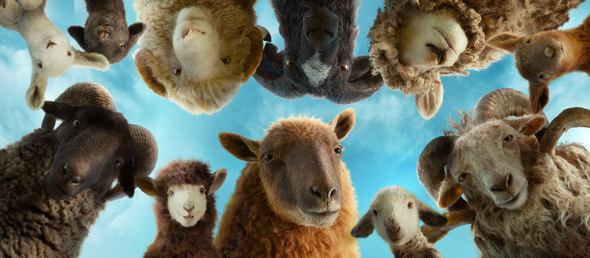

I think we are witnessing the cold death of cinema.

Take the recent backlash against **Supergirl**. People are hating on it like it’s the worst movie ever made. Look, it’s the start of a brand-new cinematic universe, of course every single film isn’t going to be a masterpiece. Was it *great*? No. Was it trash? Not at all. It was a solid 7/10 and a perfectly fun one-time watch. People complained that the villain was flat, but he wasn't even a major villain! He was just a minor bad guy from a single comic book run. It feels like audiences today only want to watch flawless, exceptionally made masterpieces, and they ruthlessly trash literally everything else.

The proof is in the box office. Just this year, we got two incredibly well made movies: He-Man: Masters of the Universe and The Sheep Detectives. Audiences loved them. Critics loved them. Yet, both bombed. Why?

We can’t just blame bad marketing anymore. Look at **Obsession** or **The Backrooms**, they had virtually no marketing, yet they became massive, runaway successes because they were exceptional. Were He-Man and The Sheep Detectives better than those two? No. But did they deserve to empty out theatres? *Absolutely not*.

If this theatrical fatigue continues, we are going to lose the *fun*, *whimsical* mid-budget movies. We’ll be left with nothing but *uninspired reboots*, *decades-late sequels*, and *cheap remakes*. Directors will stop experimenting, and the true era of cinema will slowly come to a halt. It’s devastating to even think about.

A movie shouldn’t have to be a flawless 10/10 blockbuster just to break even. It just needs to keep you engaged and entertained for a couple of hours. So, tell your friends, grab some tickets, and actually go to the theatres. Because right now, traditional filmmaking might be the only thing left that won't be contaminated by **GenAI** slop anytime soon.