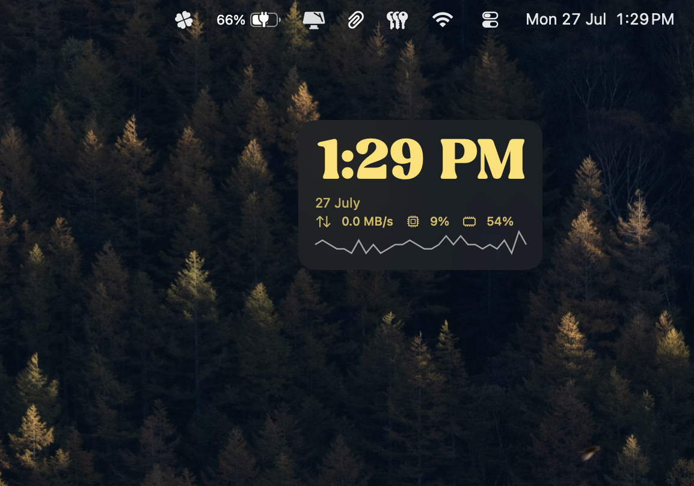

Nothing special, just a normal always on top clock for macOS. Why? There is a severe lack of such applications for mac that aren’t a massive cash grab. 

Like, really? Subscription based IAPs for a clock app?

I made this open sourced, so anyone can modify and redistribute. Subject to License.

---

## Prerequisites

Required to have macOS 14+. If you have an older version of macOS, let me know, and I'll see if I can modify and rebuild a version you need.

---

## Installation

1. Download the latest `.dmg` release from the **Releases** section.
2. Open the `.dmg` and drag `Clover.app` into your `/Applications` folder.
3. **First Launch (macOS Gatekeeper):** Because this app isn't signed with a $99/year Apple Developer certificate, macOS will block it on first run. To open:
   * Go to **System Settings > Privacy & Security**.
   * Scroll down to the security section and click **Open Anyway** next to the Lantern block notice.

---

## Updates

If you have any feature ideas, please do let me know, and we can work on that swift-ly (pun definitely intended). Plus, if you find any bugs, or memory leaks (I hope not), mention them in the issues panel, and I would love to take a look. Peace!

*Clover is officially running stable. Check out the release page to grab the latest DMG build!*