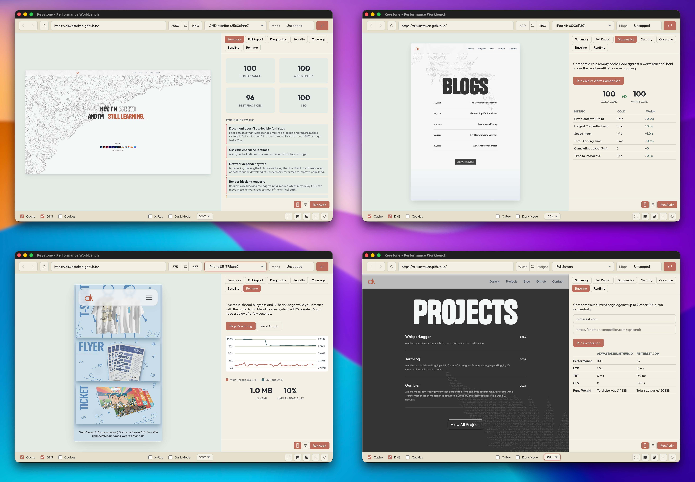

Testing how a website actually performs usually means bouncing between five different tools: a browser's own DevTools for throttling, PageSpeed Insights for a Lighthouse score, a separate tab for checking security headers, and whatever paywalled service is willing to run more than three audits a day before asking for a credit card.

**Keystone** is a native Electron performance workbench that puts all of that in one place. It's a controllable browser window built around a real Chromium `<webview>`, wrapped in device emulation, network throttling, and cache control, backed by a full audit suite that runs entirely on your machine.

---

## The Feature Set

### 1. A Controllable Browser Workbench

At its core, Keystone is a Chromium `<webview>` you can reshape and constrain on demand. Device presets cover common phones, tablets, and monitors, or you can set a custom width and height directly. A scale control lets you zoom the rendered page in or out without changing the emulated viewport itself.

Network conditions are applied directly through the Chrome DevTools Protocol, the same interface Chrome's own DevTools use internally, with presets for Fast 3G, Slow 3G, offline, and a custom Mbps figure. Cache, DNS resolution, and cookies can each be independently preserved or wiped between page loads, which makes it possible to reliably test a first-time visitor's experience against a returning one, something that's normally hard to control for in a regular browser tab.

### 2. Page Inspection Utilities

A row of toggles sits alongside the browser view for quick diagnostic checks:

* **JavaScript and CSS toggles**, to see what a page looks like and how it behaves with either one disabled.
* **X-Ray mode**, which outlines every element on the page so layout structure is immediately visible.
* **A dark mode override**, independent of whatever theme the site itself implements.
* **Screenshot capture**, saved directly to the system Pictures folder.
* **Native DevTools access** for the loaded page, one click away, for anything that needs deeper manual inspection.

### 3. The Reports Panel

This is where Keystone moves past being a browser and becomes an audit tool. A dedicated side panel holds seven report tabs, each backed by its own audit pipeline:

**Summary.** Performance, Accessibility, Best Practices, and SEO scores, alongside a plain-language list of the most significant issues found on the page and why each one matters.

**Full Report.** A preview of the highest-impact optimization opportunities, with a button that opens the complete, official Lighthouse HTML report in its own window, at full size, rather than squeezed into a side panel.

**Diagnostics.** Runs the same page twice in sequence, once against a completely empty cache and once with a warm one, and shows the real measured difference caching makes to load time and Core Web Vitals. This isn't a hypothetical estimate; it's two real audits, diffed.

**Security.** A passive check of the page's response headers and negotiated protocol: whether HTTPS is enforced, whether HSTS and a Content-Security-Policy are present, and a handful of other headers that commonly get missed. This is a configuration check, not a vulnerability scanner, and doesn't claim to be one.

**Coverage.** Uses Chromium's own code coverage instrumentation to report exactly how many bytes of downloaded JavaScript and CSS were never executed during page load, sorted by wasted weight. Directly useful for deciding what to code-split or tree-shake.

**Baseline.** Runs the same performance audit across your current page and up to two additional URLs, side by side, in one pass. Built for comparing a staging build against production, or your own site against a competitor's, with actual numbers instead of a gut feeling.

**Runtime.** A live chart of main-thread activity and JS heap usage while you interact with the page after it's already loaded. Lighthouse only measures what happens during initial load; this catches jank and memory growth caused by scrolling, opening modals, or anything else that happens afterward.

---

## Under the Hood: The Architecture

### The webview is the browser, not the audit target

Throttling and cache control are applied straight to the live `<webview>` through its own Chrome DevTools Protocol debugger session. This part talks directly to the page you're looking at, with no intermediary.

### Audits run in an isolated, disposable browser

Electron's embedded Chromium does not implement the full CDP target-creation surface that Lighthouse expects (`Target.createTarget` specifically isn't supported inside an Electron host window). Rather than fight that limitation, every audit tab in the Reports panel launches its own separate, temporary instance of `chrome-headless-shell`, a stripped-down, headless-only Chromium build made specifically for automation. Puppeteer drives it, and Lighthouse runs against that instance directly rather than against the app's own window.

`chrome-headless-shell` was chosen deliberately over a full Chrome or Chromium download, since it doesn't require the user to have a browser already installed on their system, and it's a meaningfully smaller download than bundling an entire desktop browser purely for background audits.

Each report run gets its own fresh browser instance and closes it when finished. No audit persists across runs, and only one audit can run at a time, enforced by a lock in the main process, since Lighthouse's internal trace capture doesn't tolerate overlapping runs cleanly.

### Cold versus warm, without hand-waving

The Diagnostics tab's cache comparison works by running two Lighthouse passes against the same headless browser process. The first run uses Lighthouse's default behavior, which clears storage before auditing. The second run explicitly disables that reset, so it inherits whatever cache the first run just populated. The result is a genuine before-and-after measurement, not a simulated one.

### Coverage and security checks reuse the same primitives

The Coverage tab uses Puppeteer's built-in JS and CSS coverage APIs, themselves thin wrappers around Chromium's `Profiler` and `CSS` CDP domains, comparing total bytes downloaded against bytes actually executed. The Security tab listens for the main document's response headers over the CDP `Network` domain during a single page load and checks them against a fixed list of standard protections. Neither one depends on an external service or database; both read directly from the browser's own network layer.

### Everything scoring-related sits on Lighthouse, unmodified

Keystone doesn't reimplement Lighthouse's scoring model, its performance metrics, or its audit definitions. It calls the same engine that powers Google's own PageSpeed Insights, feeds it the page currently loaded in the workbench, and presents the result. The value Keystone adds is bringing every one of these checks into a single tool, run locally, without a request limit or a paywall gating any of them.

---

## Distribution

Keystone runs as a standard Electron application. It's currently built and tested on macOS, with Windows and Linux expected to work given Electron's cross-platform nature, though not yet verified end-to-end on either.

---

## What's Coming Next

A few things are on the list for future versions:

* **Export to HTML/JSON.** Bundling a full audit's results into a standalone file that can be saved or shared, rather than only viewed inside the app.
* **Historical run tracking.** Keeping the last several audits for a given page so score changes across a coding session are visible over time, not just the most recent result.
* **Windows and Linux verification.** Confirming the full report pipeline, not just the base app, behaves correctly outside macOS.
* **A carbon/eco-efficiency estimate.** Considered for this release and deliberately left out, since the underlying estimation models are rough heuristics rather than measured data, and didn't meet the same bar as the rest of the report suite. Still worth revisiting if a more defensible model turns up.

*Keystone is running stable as of v1.0.0. Grab the latest build from the releases page.*