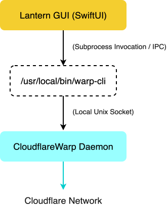

Lantern is a native macOS menu bar application built with SwiftUI that serves as a lightweight, alternative graphical interface for Cloudflare WARP. It acts as a dedicated controller for the underlying warp-cli tool, restoring a streamlined, non-intrusive workflow for managing encrypted network tunnels on macOS.

---

## Core Purpose

The primary objective of Lantern is to eliminate the interface bloat introduced in recent versions of the official Cloudflare WARP macOS application. Rather than opening a large standalone window every time a user interacts with the menu bar icon, Lantern runs strictly in the menu bar. Clicking the icon opens a compact dropdown menu that allows users to toggle connection states, change routing modes, and adjust network preferences without leaving their active workspace.

---

## Technical Architecture

Lantern does not pack or redistribute Cloudflare binaries. Instead, it operates as an orchestration layer on top of a locally installed warp-cli executable.

When an action is triggered in the interface, Lantern executes warp-cli subcommands in the background, parses the standard output or status codes returned by the daemon, and updates the menu bar interface state accordingly.

---

## Key Features and Functionality
- **Native Menu Bar Interface**: The app stays entirely within the macOS status bar. It uses system-native UI components to ensure low CPU and memory consumption.
- **Connection Mode Management**: Users can switch seamlessly between standard 1.1.1.1 DNS resolution and full WARP encrypted tunnel mode depending on their privacy requirements.
- **Trusted Network Automation**: You can configure it to automatically bypass or pause the WARP tunnel when connected to trusted WiFi networks.
- **Routing and Split Tunneling Controls**: Supports custom split tunneling configurations and local domain fallbacks, allowing local network traffic or specific IP ranges to bypass the VPN tunnel while keeping all other traffic encrypted.
- **Local Proxy Mode Support**: Allows users to toggle WARP's internal proxy server, enabling applications to route traffic through the WARP client on a per-app basis via local port forwarding rather than system-wide tunneling.
- **Launch at Login**: Option to launch at login automatically.

---

## Prerequisites

Lantern requires `warp-cli` to be present on your system to perform connection commands.

### You can satisfy this requirement in two ways:

1. **Official Cloudflare WARP App:** Keep the official app installed. Lantern will talk directly to its underlying `warp-cli` binary. (The official app DOES NOT NEED TO BE RUNNING (yay)).
2. **Standalone `warp-cli`:** Modified from the original app, with the GUI removed. The tutorial for extracting the cli yourself from the official app is [here](http://github.com/AKwasTaken/Lantern/wiki).

---

## Installation

1. Download the latest `.dmg` release from the **Releases** section.
2. Open the `.dmg` and drag `Lantern.app` into your `/Applications` folder.
3. **First Launch (macOS Gatekeeper):** Because this app isn't signed with a $99/year Apple Developer certificate, macOS will block it on first run. To open:
   * Go to **System Settings > Privacy & Security**.
   * Scroll down to the security section and click **Open Anyway** next to the Lantern block notice.

---

## Updates

If you have any feature ideas, please do let me know, and we can work on that swift-ly (pun definitely intended). Plus, if you find any bugs, or memory leaks (I hope not), mention them in the issues panel, and I would love to take a look. Peace!

*WhisperLogger is officially running stable. Check out the release page to grab the latest DMG build!*