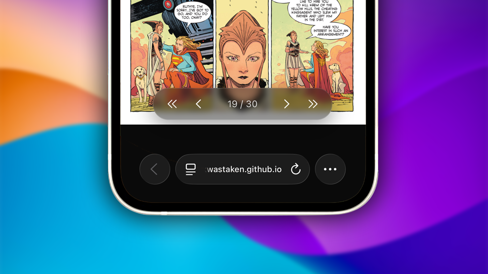

**ComicDrop** is a modern, responsive, ultra-lightweight **browser-based digital comic book reader**. It relies completely on an offline-first architecture, turning your web browser into a native-class layout and rendering engine with zero server dependencies.

Here is a deep dive into the design choices, custom features, and engineering pipelines behind the app.

---

## The Feature Set

### 1. Universal Local Extraction Pipelines

The application features a drag-and-drop interface capable of handling the web's most common digital comic archive containers. Unpacking file streams directly inside the client engine, it natively accepts:

* **.cbz / ZIP**: Extracted locally using native standard streaming structures.
* **.cbr / RAR**`: Unpacked through localized decompression wrappers.
* **.cb7 / 7z**`: Handled via custom WebAssembly filesystem mappings to execute low-level extractions.

### 2. Dual-Canvas Layer Swapping

To achieve smooth, zero-latency transitions between high-resolution imagery, ComicDrop implements a permanent **Double-Canvas Layering Architecture** (`#pageCanvasA` and `#pageCanvasB`). While one canvas layer is actively displaying the page in view, the background canvas is silently loading, rendering, and scaling the upcoming image asset ahead of time. When a page turn triggers, the app cleanly swaps opacity states instantly on the GPU thread.

### 3. Integrated System Control Capsule

Designed to keep the layout minimalist, the top-center capsule handles system configurations cleanly. It groups system actions into a blurred, dark-glass deck that slides off-screen on command to maintain complete focus. It features:

* **Hide UI Toggle**: Collapses all interface overlays instantly. A simple tap anywhere on the background reading space brings them right back.
* **Adaptive Fullscreen**: Utilizes live browser feature queries to hide or show native fullscreen toggles dynamically based on hardware platform limitations (such as iOS constraints).



### 4. Compact Control Deck

Navigation is grouped into a central control cluster at the bottom edge. Positioned safely using device environment calculations (`env(safe-area-inset-bottom)`) to sit right above mobile browser navigation rows, it includes first, previous, next, and last page markers mapping custom sanitized inline SVGs alongside an interactive text container to trigger precise page number edits.

---

## Under the Hood: The Architecture

ComicDrop is optimized to ensure that massive high-resolution comic book graphic archives can run smoothly on low-power mobile viewports. Here is how the core systems operate under the hood:

### 1. Sliding Window Cache Memory Management

Decompressing a 500MB comic archive with hundreds of pages directly into browser memory all at once will instantly crash mobile tabs. To fix this, the engine enforces a strict **Sliding Window Cache** (`Map`) that monitors memory allocations dynamically during page turns:

```javascript
manageMemoryBuffer(activeIndex) {
  for (const cachedIndex of this.blobCache.keys()) {
    if (cachedIndex < activeIndex - 1 || cachedIndex > activeIndex + 2) {
      URL.revokeObjectURL(this.blobCache.get(cachedIndex));
      this.blobCache.delete(cachedIndex);
    }
  }
}
```

By retaining only the current page, one page behind, and two pages ahead, the application actively revokes old Object URLs and cleans up heap storage. This leaves the memory footprint light and predictable regardless of the size of the comic book.

### 2. Isolated WebAssembly Filesystem Mapping

To extract complex `.7z` and `.cb7` files inside the browser without a server, the application dynamically compiles a compressed WebAssembly instance at runtime and hooks straight into an isolated internal folder pipeline:

```javascript
js7z.FS.writeFile('/archive.7z', new Uint8Array(arrayBuffer));
await new Promise((resolve, reject) => {
  js7z.onExit = (code) => code === 0 ? resolve() : reject(new Error('7z extraction failed'));
  js7z.callMain(['x', '/archive.7z', '-o/out']);
});

```

By piping the archive arrays directly into the WASM binary execution loop, extraction takes place concurrently on low-level machine threads, sorting and mapping assets on the fly.

### 3. Native Gesture & Scale Initialization

The application maps responsive touch tracking configurations alongside standard keyboard listeners. It isolates zoom modifiers explicitly to single image targets, utilizing wheel listeners for precise desktop scaling, custom multi-touch hooks for swipe page tracking, and direct double-tap event bounds to clear zoom matrices cleanly across page transitions:

```javascript
img.addEventListener("touchend", (e) => {
  const currentTime = new Date().getTime();
  const tapLength = currentTime - lastTap;
  lastTap = currentTime;
  if (tapLength < 300 && tapLength > 0) {
    e.stopPropagation();
    img._zoomScale = 1.0;
    img._panOffset = { x: 0, y: 0 };
    img.style.transform = `translate(0px, 0px) scale(1)`;
  }
});
```

---

## Performance & Optimization

To maximize processing efficiency on mobile devices, ComicDrop splits layout animations and background downloads across specific device profiles:

* **Conditional Media Queries**: The background grid parallax parallax simulation layer is wrapped inside an explicit `@media (min-width: 800px)` breakpoint. This ensures mobile devices don't waste battery power rendering 30,000px asset scrolling sheets.
* **Unified Layout Centering**: Built completely around responsive, fixed dynamic viewport units (`100dvh`), structural elements use exact pixel bounds to guarantee clean vertical layout centering on iOS platforms.

*ComicDrop is fully polished and deployed. Check out the project link to load the comic reader now!*