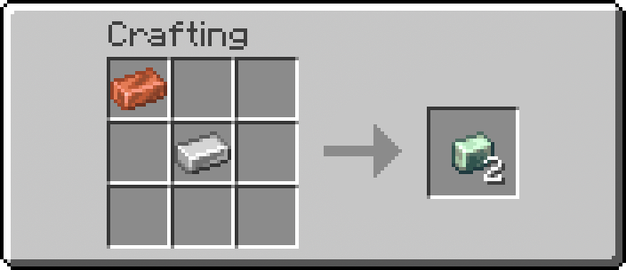
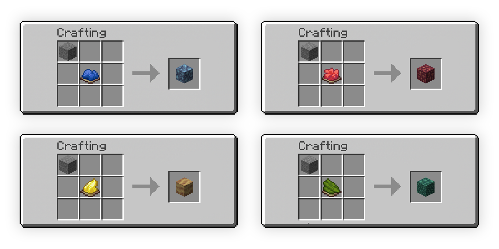

# Create Tweaks: Retro-Generation Recipes

A lightweight Minecraft datapack designed for the **Create Mod** ecosystem that introduces balanced, vanilla-friendly crafting recipes for custom world-generation resources. It serves as a seamless quality-of-life fix for existing worlds where traveling thousands of blocks to find new chunks isn't ideal.

---

## Features

* **Retroactive Compatibility**: Allows players to obtain Create mod natural materials without needing to generate new, unexplored chunks.
* **Resource Conversion**: Adds direct crafting recipes for key progression blocks: **Asurine**, **Crimsite**, **Ochrum**, **Veridium**, and **Zinc Ingots**.
* **Instant Recipe Discovery**: Automatically unlocks all custom recipes in the player's vanilla Recipe Book the moment the world or server loads.
* **Zero Performance Impact**: Leverages standard data-driven JSON mechanics with optimized function loops to keep gameplay entirely lag-free.

---

## Technical Architecture

The core functionality leverages Minecraft's native data-driven engine to override and inject custom recipes and logic hooks:

* **Recipe Framework**: Built using standard `minecraft:crafting_shapeless` JSON recipes inside the `data/createtweaks/recipe/` namespace, making ingredients easily modifiable.
* **Initialization Loop (`load.mcfunction`)**: Hooks into the global `#minecraft:load` event to execute a `/recipe give` command instantly for all active players when the server boots or reloads.
* **Event Loop (`tick.mcfunction`)**: Hooks into the `#minecraft:tick` array (running 20 times per second). It is intentionally left unbloated to ensure optimal server performance while leaving room for custom developer logic.
* **Cross-Version Scalability**: Engineered with structural flexibility, allowing the pack format ranges and namespace structures (`recipe/` vs `recipes/`) to be manually refactored for legacy Minecraft variants.

---

## Getting Started

### Prerequisites

* A Minecraft client running a compatible version (Supports 1.21.8 up to modern community forks like **Create Fly** on Modrinth).
* The **Create Mod** (or **Create Fly**) installed on your client or server.

### Installation

1. **Download** the datapack zip file/folder from Modrinth or Github Releases.
2. Navigate to your Minecraft world folder (`saves/<YourWorldName>/`).
3. Open the **`datapacks`** folder and drop the `createtweaks` zip file/folder inside.
4. Open your world (or type **`/reload`** in the chat if you are already in-game) to initialize the recipes.