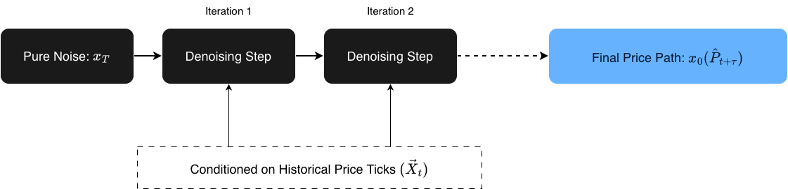
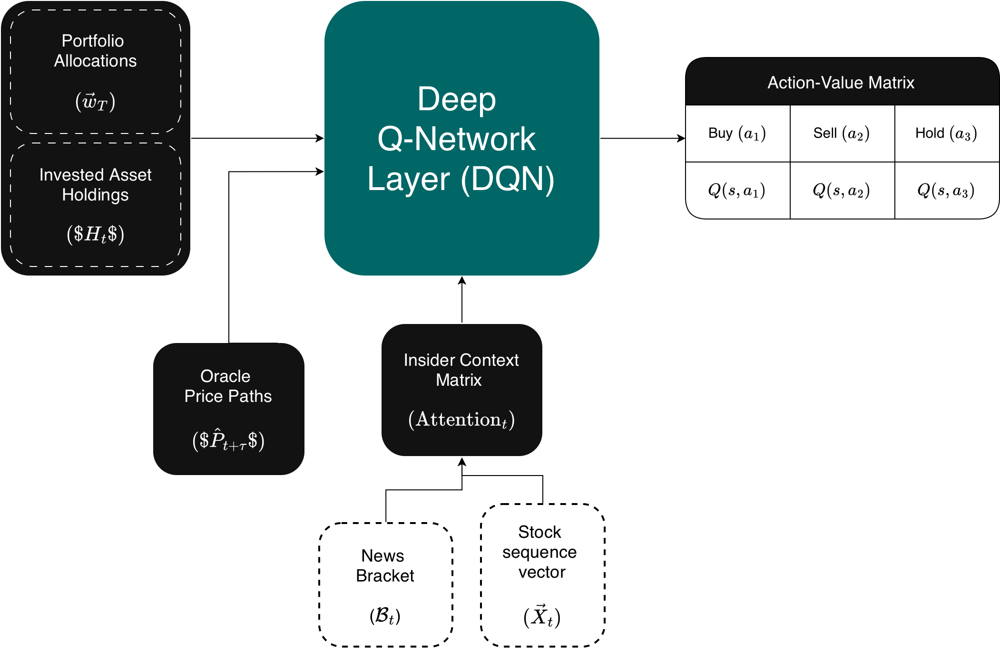

This project, although incomplete, represents our hands-on understanding of how a highly capable market predictor should actually be built. The core philosophy here is to attack the problem from two completely different angles: reading public sentiment and analyzing raw stock-graph math. By combining real-time human emotion (the chaos of breaking news headlines) with raw statistical trend forecasting, we wanted to build a system that can process market information the same way an actual human day-trader would—just at a much larger, automated scale.

**Gambler** is made of two model/tools, **Insider** and **Oracle**, who's architecture is discussed in detail below.

---

## 1. Insider: The News-to-Vector & Timing Engine

The main goal of **Insider** is to grab non-stop, chaotic text streams from the internet, turn them into smooth math vectors, and track how they mess with stock prices over time.

### 1.1 Making the News Bracket

Let is assume $\mathcal{N}_t = \{n_1, n_2, \dots, n_k\}$ is just the bunch of news articles we collected inside a short time window $[t - \Delta t, t]$. We can play around with this time window, setting $\Delta t$ to something like 5, 10, or 15 minutes to see what gives the best results. Each piece of news $n_i$ is saved as a clean data packet:

$$n_i = \langle T_i, A_i, D_i, \mathcal{P}_i, \mathcal{W}_i \rangle$$

To break that down: $T_i$ is when the article dropped, $A_i$ is the headline string, $D_i$ is the actual content text or summary, $\mathcal{P}_i$ is the news outlet (like Bloomberg or some random blog), and $\mathcal{W}_i$ is the specific author who wrote it.

To turn this messy text into numbers we can actually run math on, we use a high-capacity Transformer encoder $\Phi$ (essentially a smart AI model trained to understand human language). It takes the headline and summary and maps them into a fixed $d$-dimensional continuous space:

$$\vec{v}_i = \Phi(A_i, D_i) \in \mathbb{R}^d$$

This vector conversion captures the deeper vibe of the text—things like semantic intensity (how aggressive the words are), structural themes (what topic it is talking about), and sentiment orientation (whether it's good or bad news). The full collection of these dense embeddings (number clusters) generated during our time window gives us our **News Bracket** $\mathcal{B}_t$:

$$\mathcal{B}_t = \Big\{ \vec{v}_i \in \mathbb{R}^d \;\Big|\; T_i \in [t - \Delta t, t] \Big\}$$

Because we are throwing these into an $d$-dimensional manifold (a multi-dimensional math space), similar news naturally clumps together. If you calculate the Cosine Similarity—which is just a fancy way of measuring the angle between two vectors to see how close they point to the same idea—you'll find that all the political drama sits on one side, tech updates on another, and sports in its own corner:

$$\text{Sim}(\vec{v}_i, \vec{v}_j) = \frac{\vec{v}_i \cdot \vec{v}_j}{\|\vec{v}_i\| \|\vec{v}_j\|}$$

---

### 1.2 Aligning the Timing with Cross-Attention

People don’t read an article and instantly hit buy or sell within a millisecond; there's always a lag. To handle this, we add a buffer zone $\delta$ of about 3 to 5 minutes.

To see how our News Bracket $\mathcal{B}_t$ actually impacts a stock, we use a **Cross-Attention Mechanism**—a technique that lets the model focus on specific words in a massive pile of text that correlate to a specific price jump. We take the raw price ticks of the stock and turn them into a sequence vector $\vec{X}_t$. The price data acts as our Queries ($Q$), while the text vectors in the News Bracket act as the Keys ($K$) and Values ($V$):

$$Q = \mathbf{W}_Q \vec{X}_t, \quad K = \mathbf{W}_K \mathcal{B}_t, \quad V = \mathbf{W}_V \mathcal{B}_t$$

Here, the $\mathbf{W}$ matrices are just the weights the AI learns and tweaks over time. We calculate the alignment context using scaled dot-product attention:

$$\text{Attention}(Q, K, V) = \text{softmax}\left(\frac{Q K^T}{\sqrt{d_k}}\right)V$$

This matrix math spits out a clean probability distribution. It basically tells us, *"Hey, when this specific kind of text cluster shows up, the stock chart does this weird anomaly right after."*

If we run this for months or years, we build a solid probability density function. Instead of assuming the news affects everything equally (a flat line), we map a wavy, non-linear distribution showing exactly how much specific vector clusters shift a stock's variance ($\sigma^2$, or risk/volatility) and price direction ($\Delta P$).

---

## 2. Oracle: The Pure Price & Diffusion Engine

While **Insider** is busy reading the news, **Oracle** focuses purely on the numbers. Its job is to look at raw historical price charts and predict where the stock is headed next, completely blind to what is happening in the outside world.

### 2.1 Why Diffusion?

Most traditional financial AI models try to draw a single, boring average line into the future. The problem is that stock markets don't move in clean, predictable lines—they are jagged, chaotic, and jump around. To capture that real-world messiness, we decided to use a **Diffusion Model**.

If you've ever used an AI image generator, it uses diffusion: it starts with a canvas of pure random static/noise and slowly cleans it up step-by-step until a sharp image appears. We are doing the exact same thing, but instead of generating an image of a cat, our model starts with a noisy, random scribble of a stock chart and refines it into a highly realistic future price path.

### 2.2 Mathematical Framework of the Generative Process

To model this, we define a reverse Markov chain (a step-by-step process where the next state only depends on the current one). The model learns to subtract noise over a series of deliberate steps $T$:

$$p_\theta(x_{0:T} | \vec{X}_t) = p(x_T) \prod_{t=1}^T p_\theta(x_{t-1} | x_t, \vec{X}_t)$$

To break down what this math is actually saying:

* $\vec{X}_t$ is our anchor—the actual historical price data we already know.
* $x_T$ is our starting point for the prediction—pure, random Gaussian noise (essentially digital static).
* $p_\theta(x_{t-1} | x_t, \vec{X}_t)$ is the smart part of the network. It looks at the noisy chart ($x_t$), remembers the historical trend ($\vec{X}_t$), and guesses how to clean up a fraction of the noise to get to the next cleaner step ($x_{t-1}$).

By repeating this denoising process all the way down to $x_0$, the model spits out a sharp, highly detailed forecast path $\hat{P}_{t+\tau}$.

Not many people are using Diffusion models for day-trading right now—mostly because they take a lot of processing power and can be slower than basic models. But we wanted to test it out because it gives us a distribution of multiple possible future realities instead of just a generic, flat average line. This specific output path ($\hat{P}_{t+\tau}$) is what we feed directly into the **Gambler DQN** decision brain.

---

## 3. Gambler: The Reinforcement Learning System

The actual brain of the project combines the text insights from **Insider**, the price paths from **Oracle** (which tries to guess where the stock goes next using just past pricing data), and our current portfolio stats. It jams them into a single state vector for our Deep Q-Network (DQN) agent—which is an AI that learns by trial and error to maximize a score.

### 3.1 Setting Up the Markov Decision Process (MDP)

To turn trading into a game the AI can solve, we break it down into an MDP—a math framework for modeling decision-making where outcomes are partly random and partly controlled by the user.

* **State Space ($s_t \in \mathcal{S}$):** This is everything the model knows about the world at any given moment $t$, put together in a single row:

$$s_t = \Big[ \vec{w}_t, \; H_t, \; \hat{P}_{t+\tau}, \; \text{Attention}(Q,K,V)_t \Big]$$

To translate: $\vec{w}_t$ is how our cash vs. stock split looks right now, $H_t$ is our holding limits, $\hat{P}_{t+\tau}$ is what the Oracle thinks the stock price will do next, and $\text{Attention}(Q,K,V)_t$ is the real-time news vibe from Insider.

* **Action Space ($a_t \in \mathcal{A}$):** The choices the model can make are straightforward day-trading moves:

$$\mathcal{A} = \{ \text{BUY}, \; \text{SELL}, \; \text{HOLD} \}$$

*(If we want to scale this up to handle a bunch of different stocks at the same time, we can change this from a simple choice list to a continuous vector $\Delta \vec{w}_t$ that dynamically re-balances the whole portfolio).*

---

### 3.2 Training and Optimization

The action-value function $Q(s, a; \theta)$ uses a deep neural network with weights $\theta$ to calculate which action gives the best payout. The model trains by looking at a replay buffer (a memory log of its past trades) and trying to minimize its Bellman error—basically reducing the gap between what it *thought* would happen and what *actually* happened:

$$L(\theta) = \mathbb{E} \left[ \left( r_t + \gamma \max_{a'} Q(s_{t+1}, a'; \theta^-) - Q(s_t, a_t; \theta) \right)^2 \right]$$

Breaking down the variables:

* $r_t$: This is the immediate reward signal. To keep the model from doing insane, risky gambles during high-volatility news events, the reward tracks our total portfolio value change, but heavily penalizes any downside drops:

$$r_t = \Delta \text{Value}(\text{Portfolio})_t - \lambda \cdot \min(0, \Delta \text{Value}_t)^2$$

*(The parameter $\lambda$ is just a slider that controls how risk-averse or cautious we want the model to be).*

* $\gamma \in [0, 1)$: The discount factor. It determines whether the model cares more about making cash right this second versus holding out for a bigger win down the road.
* $\theta^-$: These are the target network weights. We copy our main network weights over here every once in a while to keep the AI's training stable so it doesn't spin out of control.

---

## 4. Conclusion & Project Status (Incomplete)

As it stands right now, **Gambler** remains an incomplete proof of concept. While the theoretical architecture is solid, we ran into the ultimate final boss of financial tech projects: data paywalls and severe infrastructure bottlenecks.

### Why We Couldn't Complete It

* **The News API Paywall:** Gathering high-frequency textual data in real-time is an incredibly expensive game. Free tier news APIs either have massive delays or strict rate limits (capping how many data pulls we can request per hour). To actually build a functional, real-time **Insider** database across both trustworthy and sketchy media outlets, we needed premium data pipelines that were well out of our budget.
* **The Isolated Oracle:** Because we couldn't feed continuous, well-parsed news brackets into the system, we were only able to properly experiment with **Oracle's** diffusion mechanics using historical pricing charts. But a trading brain can't make smart ecosystem-wide decisions with only one half of its head working. Without the real-time cross-attention context from **Insider**, our **Gambler DQN** agent didn't have a complete state vector ($s_t$) to train on.

### The Takeaway

Even though we couldn't turn this into a live, self-executing day-trading bot, the experiment proved exactly what we wanted to figure out: market predictions shouldn't just look at smooth average trend lines. The market reacts to raw human panic, hype, and chaos, and mapping that chaos into multi-dimensional math clusters via semantic analysis is entirely possible. If we ever get our hands on unrestricted, high-frequency text APIs and a massive compute budget to run continuous diffusion paths, this might seem a really fun experiment on predicting stocks!

### Bonus: Hidden Value in the Context Matrix

The cool thing is, we can actually get a lot more out of this project than just trading signals. Once that multidimensional context-matrix is fully built and running, it turns into a massive goldmine for media analytics. Since every single article is tied to an author ($\mathcal{W}_i$) and a publisher ($\mathcal{P}_i$), we could easily cross-reference their past text vectors against actual real-world market movements to extract all kinds of crazy statistics, like:

* **Author Trustworthiness Scores:** Tracking which individual writers routinely call major industry shifts versus those whose breaking articles consistently lead to zero market reaction (or worse, false hype).
* **Publisher Sentiment Bias:** Calculating the exact mathematical baseline of specific outlets to see who has a structural habit of spinning news overly positive or negative on average. 

Essentially, instead of just tracking the stock market, you accidentally build a highly sophisticated, data-driven BS detector for financial journalism.

Let's hope we complete this someday!

Also, check out [nveshaan's site](https://nveshaan.github.io). He pitched the core idea and architecture for Oracle, which actually won third place at our college's annual fest, Anvesha@IISERTvm! (Sadly, no cash prizes for third place, though). His works are pretty cool, so definitely give his page a look.