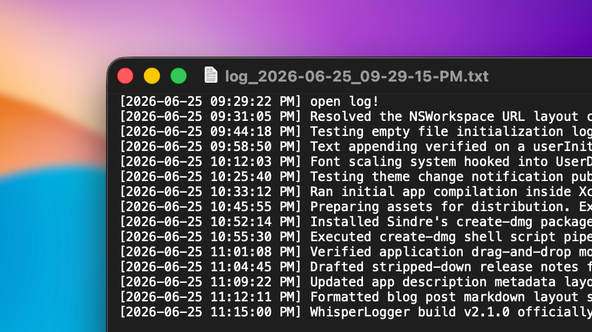
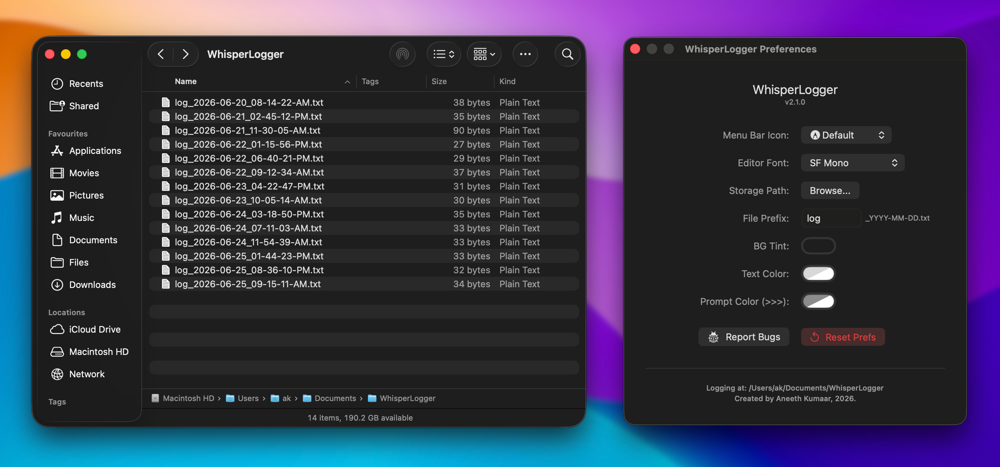

Every developer needs a friction-free way to jot down rapid logs, temporary scratch notes, or track task statuses throughout the day. Opening a bloated IDE window, a browser tab, or a heavy text editor disrupts your flow state. 

To solve this, I built **WhisperLogger**: a distraction-free, ultra-lightweight **native macOS utility** designed to capture your chronological thoughts without pulling you away from your active workspace. 

Here is a deep dive into the features, design choices, and core engineering behind the application.

---

## The Feature Set

### 1. Zero-Friction Input Workspaces
The core UI layout is built explicitly around rapid keyboard entry. It utilizes an AppKit `NSTextView` backed layout inside a SwiftUI canvas wrapper to maintain highly responsive frame scaling, complete with custom styled prompt hooks (`>>>`). It natively supports standard power-user text mechanics:
* **`Command + Return`**: Instantly commits the active log entry to your disk layer.
* **`Escape`**: Immediately hides the interface panel.

### 2. Streamlined Empty Log File Creation
WhisperLogger gives you complete flexibility over your organization. Using the `⌘ + Shift + Return` keyboard shortcut, you can spin up a freshly timestamped text document on demand completely empty, perfect for initializing a clean daily workspace layout before you even start typing.

### 3. Integrated Live Folder Navigation (`⌘ + O`)
To keep your data highly accessible, pressing `⌘ + O` directly within the active logging entry window instantly opens your output workspace directory inside a native Finder window so you can view, move, or share your raw text files seamlessly.



---

## Under the Hood: The Architecture

WhisperLogger is built to be fast and compliant with modern macOS sandboxing rules. Here is how the core engine handles data under the hood:

### 1. Sandboxed File Isolation
To respect macOS security layers while keeping your files easily accessible, WhisperLogger isolates its data cleanly away from hidden system configuration paths. By default, it initializes its storage vault directly inside a dedicated, user-facing path: `~/Documents/WhisperLogger_Logs`. This ensures that the system file viewer can securely trigger Finder access on demand without running into permission boundaries.

### 2. Multithreaded Async Disk I/O Pipeline
To prevent dropped keystrokes or interface lag when committing long string streams, the entire file execution layer runs asynchronously:

```swift
DispatchQueue.global(qos: .userInitiated).async { [weak self] in
    guard let self = self else { return }

    // Secure append and system file synchronization logic  
    // happens completely out of process

    self.refreshLogFiles()
}

```

Moving file serialization onto standard `.userInitiated` background worker channels ensures that text operations stay fast and concurrent, leaving the main thread completely untethered to keep the UI snappy and responsive.

---

## Distribution & Presentation

To package the tool cleanly without dealing with bloated layout configuration files, the application is compiled into a drag-and-drop installer image natively aligned to macOS dark-mode standards.

Your active files are saved cleanly by timestamp, making it incredibly easy to parse your logging history linearly over days or weeks.



---

## What’s Coming Next

While the application is fully optimized for targeted desktop logging, future lifecycle expansions are on the horizon, including:

* **Global Hardware Hotkeys:** Listening to system-wide shortcuts (`⌥ + Space`) so the entry canvas can drop down instantly from anywhere across the OS.
* **File Manager:** A window that can preview all the files created by the application, in the working directory.
* **Log-file Support:** Support for log-files, since they are much more comfortable and easier to troubleshoot and work with.
* **More UI Preferences:** Self-explanatory.

*WhisperLogger is officially running stable. Check out the release page to grab the latest DMG build!*
